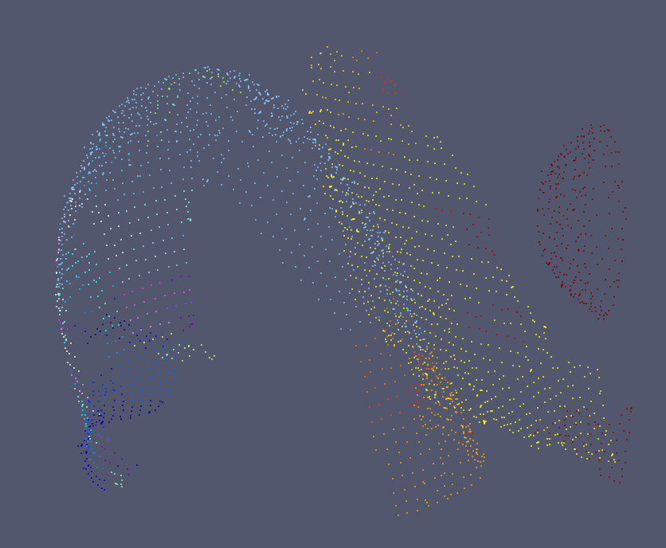
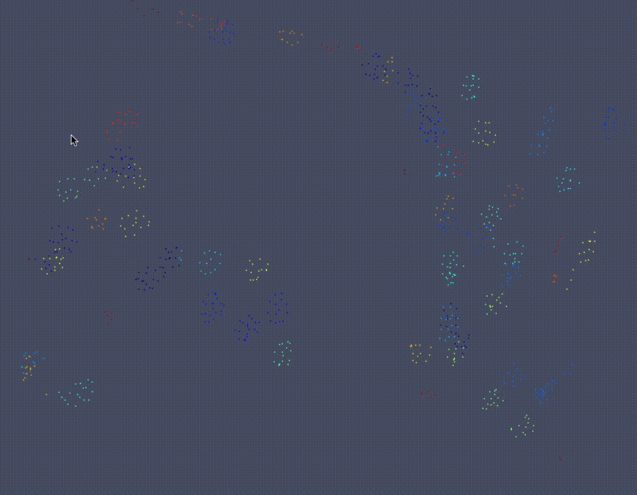
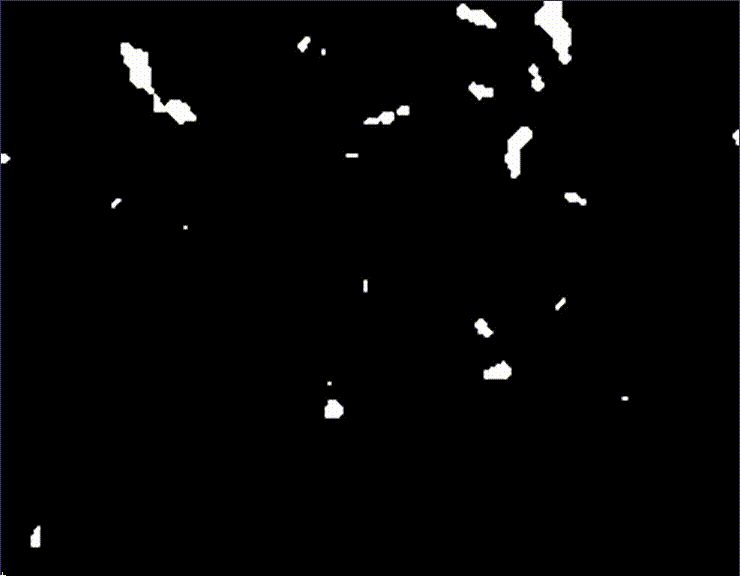

# tracET: A Software for tracing low-level structures in cryo-Electron Tomography


## Requirements
* Python with the packages listed in the document [requirements.txt](https://github.com/PelayoAlvarezBrecht/tracer/tree/pypi/requirements.txt)
* Ensure all of them are installed before installing the package. **This package does not install them automatically**.

## Instalation
You can install tracET in two ways:
* From PyPI (recommended):
  * In a python terminal, write
```commandline
pip install -i https://test.pypi.org/simple/ tracET
```
  * If it desnt work, try:
```commandline
pip install -i https://test.pypi.org/simple/ tracET --no-build-isolation
```
  * If is not do it automatically, add this line to your bashrc to add the scripts as commands:
```commandline
export PATH=$PATH:~/.local/bin
```
* From Github:
  * Clone the repository https://github.com/PelayoAlvarezBrecht/tracer/
  * In a terminal, open the subdirectory *cmodules*
  * Execute the command *python setup.py install*


## Scripts
There is six different scripts to apply different parts of the process:

### Saliency map:
* Script description:
  * The name of the script is get_saliency.py
  * From a tomogram with a binary segmentation, calculates the saliency map, a distance transfromation of the input softed with a gaussian filter.
  * This step is also included in the apply_nonmaxsup.py script.

* Parameters:
  * The parameter *in_tomo*, called with "-i" or "--itomo", needs the name of the input file. A binary map tomogram in a mrc format or nrrd format.
  * The parameter *smooth_deviation*, called with "-s" or "-sdesv", is the desviation for gaussian filter and it should be ~1/3 of the element radium.

* Outputs:
  * A tomogram with the saliency map, in the same format of the input and with the same name with the sufix _*saliency*

### Non-Maximum Suppression:
* Script description:
  * The name of the script is apply_nonmaxsup.py
  * From a segmentation or a saliency map, detect the most central voxels of the elements and construct an equiespatial point cloud of this elements. 
  

* Parameters:
  * The parameter *in_tomo*, called with "-i" or "--itomo", needs the name of the input file. A scalar or binary map tomogram in a mrc format or nrrd format.
  * The parameter *smooth_deviation*, called with "-s" or "-sdesv", is the desviation for gaussian filter and it should be ~1/3 of the element radium.
  * The parameter *skel_mode*, called with "-m" or "--mode", is the structural mode for computing the skeleton: "s" for surfaces, "l" for lines and "b" for blobs.
  * The parameter *binary_input*, called with "-b" or "--ibin", needs to be 0 if is a scalar map, and 1 if is a binary map. In this case, it calculates the distance transformation saliency map.
  * The parameter *filter*, called with "-f" or "--filt", is the filter for the mask of the suppression. Is optional and if is not given, only eliminate negative values.
  * The parameter *downsample*, called with "-d" or "--downs", if is given, apply a downsample of the radius indicated.
  

* Outputs:
  * A tomogram with only the maximums of the saliency map, in the same format of the input and with the same name with the sufix _*supred*

### Spatial Embedded Graph
* Script description:
  * The name of the script is `trace_graph.py`. Is called with the command:
```commandline
trace_graph - options
```
  * From a point cloud of filaments, trace a spatial embedded graph, calculates the different connect components, the different subbranches and model every branch as a curve to measure the different properties.
  

* Parameters:
  * The parameter **input**, called with `-i` or `--itomo`, is the tomogram with the point cloud of the filament segmentation, in *mrc* or *nrrd* format. (The output of the previous script).
  * The parameter **radius**, called with `-r` or `--rad`, is the radius for connect points in the graph.
  * The parameter **subsampling**, called with `-s` or `--subsam`, is the radius used for subsample points. If is not given, there is not subsampling.
  

* Outputs:
  * A **vtp file** with the information of the graph components, branches and geometric data, with the same name of the input and the extension "_skel_graph.vtp"
  * A csv with the information of the graph components, branches and geometric data, with the same name of the input and the extension "_skel_graph.csv"

### Blobs Clustering
* Script description:
  * The name of the script is `Get_cluster.py`. Is called with the command:
```commandline
get_cluster - options
```
  * From a point cloud tomogram of blobs, cluster the points using MeanShift or Affinity Propagation, and localize the centroids.

* Parameters:
  * The parameter **input**, called with `-i` or `--itomo`, is the tomogram with the point cloud of the filament segmentation, in *mrc* or *nrrd* format. (The output of the previous script).
  * The parameter **mode**, called with `-m` or `--mode`, is the parameter to select the algorithm of clustering:
    * If is `Affinity`, *Affinity propagation* is used. Is only recommended for small tomograms.
    * If is `MeanShift`, *Mean Shift algorithm* is used. This is recommended for all type of tomograms, but need two parameters more:
      * The parameter **blob_diameter**, called with `-b` or `--blob_d`, is the diameter of the blobs planned to detect.
      * The parameter **n_jobs**, called with `-n` or `--n_jobs`, is the number of jobs to execute the algorithm in parallel.

* Outputs:
  * A **vtp file** with the points of the ribosomes labeled with the clusters they are part, with the same name of the input and the extension `mode'*_labeled.vtp*.
  * A **mrc file** with the points of the ribosomes labeled with the clusters they are part, with the same name of the input and the extension `mode`*_labeled.mrc*.
  * A **txt file**, convertible to IMOD *.mod* file, with the information of the centroid of every cluster.

### Membrane clasification
* Script description:
  * The name of the script is `membrane_poly.py`. Is called with the command:
```commandline
membrane_poly - options
```
  * From a point cloud of membranes, it cluster the points in the different membranes.

* Parameters:
  * The parameter **in_tomo**, called with `-i` or `--itomo`, is the tomogram with the point cloud of the membrane segmentation, in *mrc* or *nrrd* format. (The output of the previous script).
  * The parameter **distance_clustering**, called with `-d` or `--dist`, is the distance of points to be part of the same cluster.
  * The parameter **min_samples**, called with `-s` or `--samp`, is the minimum samples needed to make a cluster. Is optional and if is not given, it takes value 2.

* Outputs:
  * A **vtp file** with the points of the membranes labeled with the clusters (different membranes) they are part, with the same name of the input and the extension *.vtp*.

### DICE Metric

* Script description:
  * The name of the script is `seg_skel_dice.py`. Is called with the command:
```commandline
seg_skel_dice - options
```
  * From two different binary segmentations, it calculates the TS, TP and DICE metric, and give the two skeletons of the inputs.

* Parameters:
  * the parameter **in_tomo**, called with `-i` or `--itomo`, a tomogram with a binary segmentation, in *mrc* or *nrrd* format.
  * The parameter **gt_tomo**, called with `-g` or `--igt` the ground truth segmentation, in *mrc* or *nrrd* format.
  * The parameter **skel_mode**, called with `-m` or `--mode`, is the structural mode for computing the skeleton: `s` for surfaces, `l` for lines and `b` for blobs.

* Outputs:
  * **TS metric** value.
  * **TP metric** value.
  * **DICE metric** value.
  * (Optional) Asked with `-o` or `--otomo`, **skeleton** of the input tomogram.
  * (Optional) Asked with `-t` or `--ogt`, **skeleton** of the ground truth tomogram.


## Tutorials
In this section we are going to explain how to generate a result from a example data, that we save in the following directory. (**Write here the directory**)

### Surface example: Membranes
* In the subdirectory `Membrane` we look at the file `tomo_001_mem_croped.mrc`. In paraview it looks like:


* For create the skeleton use the command with the next options: 
```commandline
apply_nonmaxsup -i tomo_001_mem_croped.mrc -s 2 -m s -b 1 -f 0.065 -d 10
```
* the result will be:


* Finnally we divide in different membranes using the command with the next options:
```commandline
membrane_poly -i tomo_001_mem_croped_supred.mrc -d 10
```

* The result in that case is:



* With this we can get the point cloud of the membrane with the membranes separated.

### Blob example: Ribosomes
* In the subdirectory `Membrane` we look at the file `tomo_001_mem_croped.mrc`. In paraview it looks like:


* For create the skeleton we use the command with the next options:
```commandline
apply_nonmaxsup -i tomo_001_ribo_croped.mrc -s 2 -m b -b 1 -f 0.065 -d 10
```

* The result will be:


* Finally, to cluster the diferent ribosomes, you just need to use the command with the next options:
```commandline
get_cluster -i tomo_001_ribo_croped_supred_time.mrc -m MeanShift -b 20 -n 20

```



* With this we already separate the ribosomes between them.

### Filamen example: Actin
* In the subdirectory `Actin` we look at the file `tomo_001_actin_trimmed.mrc`. This we show it in IMOD because is too dense to watch it in 3D:



* For create the skeleton we use the command with the next options:
```commandline
apply_nonmaxsup -i tomo_001_actin_trimmed.mrc -s 2 -m b -b l -f 0.1 -d 0
```

* The result in IMOD will be:


* Finally, to get the curves and the graph, we execute:
```commandline
trace_graph -i tomo_001_actin_trimmed_supred.mrc -r 15 -s 2 -t n
```

* The result of the graph in paraview is:


* And the curves are:


* This are the skeletons of the actin net with the first one prioritizing the connection and the second prioritizing the curvatures
